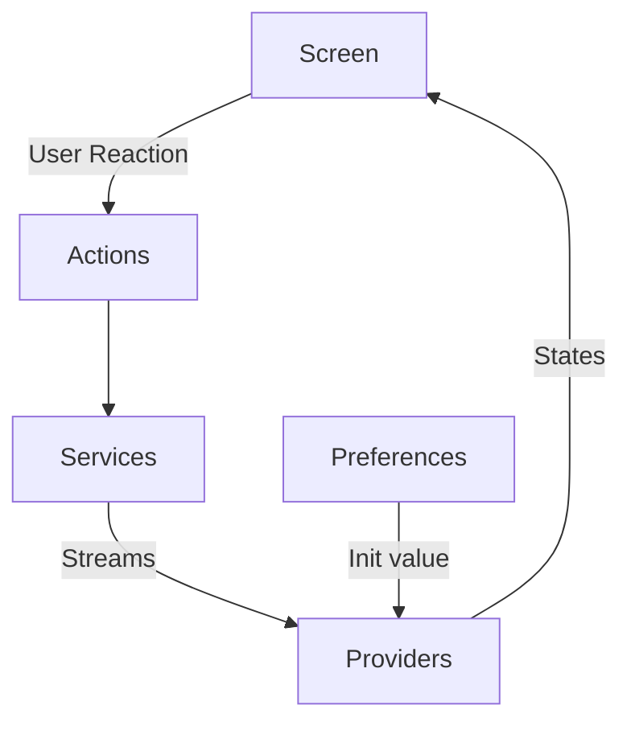

# Bunga Player

A video player allows users watching same video share progress.


## Run

Get all dependencies:

```
flutter pub get
```


Run:

```
flutter run
```


## Update assets


### Generate app icon:

```
dart run flutter_launcher_icons
```

### Fetch emojis:

```
dart run bunga_player:fetch_emojis
```

## Implement of channel joining

Main principle: 

```
Users watch same video should in same channel, and share things like watching progress, popmoji etc.
```

To implement principle above, channel id will generate accord video hash, so users watch same video will get same channel id.

### Problems associated with replacing video

There's a feature allows user replace video in a channel. This will cause channel id and video hash no longer match, in other words, makes the channel "dirty".

To solve this problem, when user joining a channel that suppose to match a specific video hash, let's say `local-AbC123`, it will check channel `local-AbC123` is dirty or not first -- join if it's clean, or `local-AbC123__1`, `local-AbC123__2`, ... until a clean one if it's dirty.

## Structure


